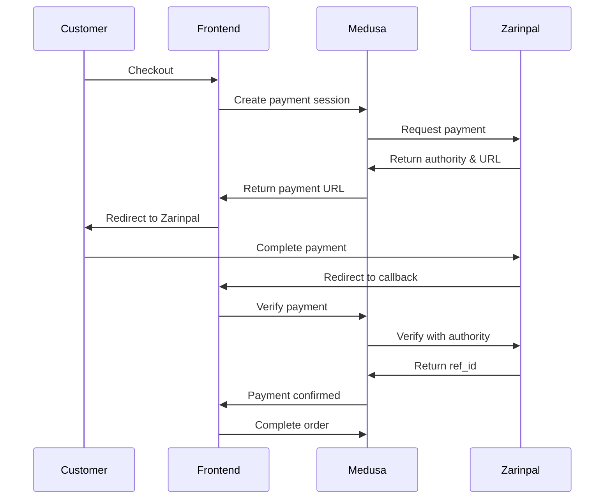

# Zarinpal Quick Start Guide

Get your Zarinpal payment gateway up and running in 5 minutes!

## 🚀 Quick Setup

### 1. Add Environment Variables

Add to your `medusa-backend/.env` file:

```env
ZARINPAL_MERCHANT_ID=your-merchant-id-here
ZARINPAL_SANDBOX=true
ZARINPAL_CALLBACK_URL=http://localhost:3000/checkout/callback
```

> 💡 Get your Merchant ID from [Zarinpal Dashboard](https://www.zarinpal.com/panel)

### 2. Restart Backend

```bash
cd medusa-backend
pnpm dev
```

### 3. Enable in Medusa Admin

1. Open Medusa Admin: http://localhost:9000/app
2. Go to **Settings** → **Regions**
3. Select your region (e.g., Iran)
4. Enable **Zarinpal** payment provider
5. Save

### 4. Test It!

Run the test script:

```bash
cd medusa-backend
.\test-zarinpal.ps1
```

This will:
- ✅ Create a test cart
- ✅ Add a product
- ✅ Generate a Zarinpal payment URL
- ✅ Show you the next steps

## 📋 Testing Credentials (Sandbox)

Use these test cards in sandbox mode:

- **Card Number**: `5022-2910-0000-0000`
- **CVV2**: `123` (any 3-4 digits)
- **Expiry**: `12/30` (any future date)

## 🔄 Payment Flow



## 📝 API Endpoints

| Endpoint | Method | Description |
|----------|--------|-------------|
| `/store/carts/:id/payment-collection` | POST | Initialize payment |
| `/store/payment-collections/:id/payment-sessions` | POST | Create Zarinpal session |
| `/store/zarinpal/verify` | POST | Verify payment after callback |
| `/store/zarinpal/status` | GET | Check payment status |

## 🎯 Frontend Integration Example

```typescript
// 1. Create payment session
const response = await fetch(
  `${MEDUSA_URL}/store/payment-collections/${paymentCollectionId}/payment-sessions`,
  {
    method: 'POST',
    headers: { 'Content-Type': 'application/json' },
    body: JSON.stringify({ provider_id: 'zarinpal' })
  }
);

const { payment_session } = await response.json();

// 2. Redirect to Zarinpal
window.location.href = payment_session.data.payment_url;

// 3. Handle callback (after redirect back)
const verifyResponse = await fetch(
  `${MEDUSA_URL}/store/zarinpal/verify`,
  {
    method: 'POST',
    headers: { 'Content-Type': 'application/json' },
    body: JSON.stringify({
      authority: searchParams.get('Authority'),
      Status: searchParams.get('Status'),
      cart_id: cartId
    })
  }
);

// 4. Complete order
await fetch(`${MEDUSA_URL}/store/carts/${cartId}/complete`, {
  method: 'POST'
});
```

## 🔧 Troubleshooting

### "Payment provider not found"
→ Make sure `ZARINPAL_MERCHANT_ID` is set and backend is restarted

### "Region doesn't support this provider"
→ Enable Zarinpal in Medusa Admin under Settings → Regions

### CORS errors
→ Add your frontend URL to `STORE_CORS` in `.env`:
```env
STORE_CORS=http://localhost:3000
```

## 📚 More Documentation

- [Full Integration Guide](./ZARINPAL_INTEGRATION_GUIDE.md)
- [Module README](./src/modules/payment-zarinpal/README.md)
- [Zarinpal API Docs](https://docs.zarinpal.com/)

## 🎉 Ready for Production?

1. Get your production Merchant ID from Zarinpal
2. Update `.env`:
   ```env
   ZARINPAL_SANDBOX=false
   ZARINPAL_MERCHANT_ID=production-merchant-id
   ZARINPAL_CALLBACK_URL=https://yourdomain.com/checkout/callback
   ```
3. Deploy and test with a small amount first!

---

Need help? Check the [troubleshooting section](./ZARINPAL_INTEGRATION_GUIDE.md#troubleshooting) in the full guide.

